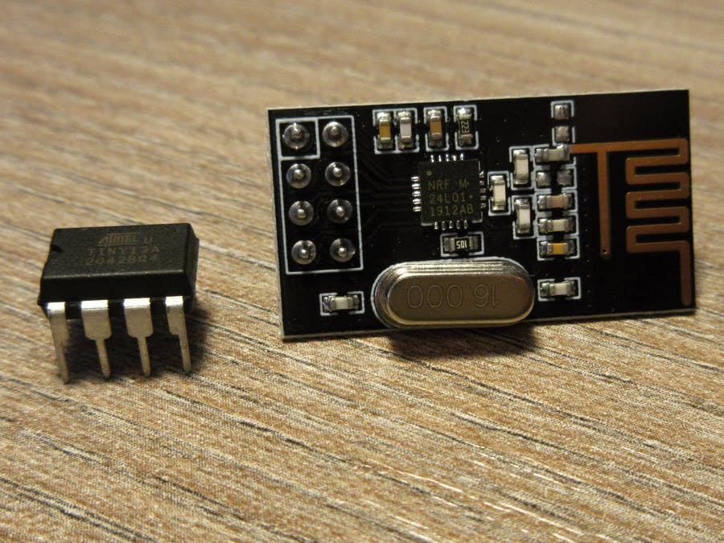
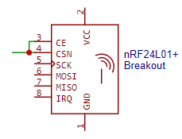
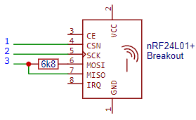
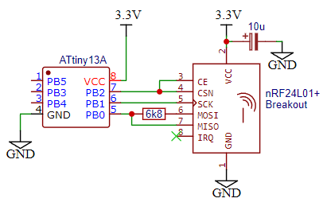
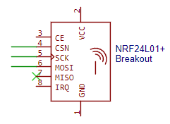
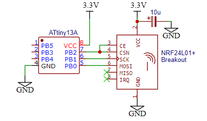
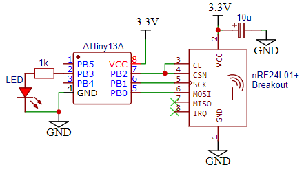
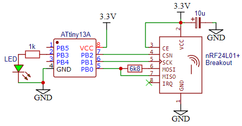

# nRF24L01+ for ATtiny13A ultra-low-power wireless sensor


OSI Layer 2 driver for [nRF24L01+](https://www.nordicsemi.com/products/nrf24-series) on [ATtiny13A](https://www.microchip.com/en-us/product/ATtiny13) (1KiB flash + 64B SRAM) for ultra-low-power wireless applications. It is devised to optimize:
- **Pin-count:** It supports three generic pin-optimization HW configurations that require none or a single resistor. The nRF24 module occupies on MCU only 3 pins instead of 6. This leaves the other 2 pins (+1 if RST used as IO) for attaching sensor(s) or a fieldbus.

- **Power consumption:** It was dedicatedly made for ultra-low-power applications. The energy-saving is achieved by the optimized library with a very small number of instructions. This reduces overall execution time. The pin-count is minimized in a way that offers better energy management of the nRF24 module than other similar approaches (shared CE/CSN vs. CE permanently active).

- **Footprint:** Very low footprint - demo applications have 378 bytes (transmitter) and 434 bytes (receiver) including the application's logic. It can easily fit into ATtiny13A and leave enough space for other applications and attached devices and field busses. It is configurable for either half-duplex or simplex radio communication to further minimize the footprint. Unlike other generic libraries, it can be also deployed on any other MCU from the ATtiny sub-family with the same or a greater memory. SPI interface is implemented as bit-banging, thus there is no dependency on peripherals such as Universal Serial Interface (USI).

[**More detailed describtion of the library on Hackster.io**](https://www.hackster.io/orfanus/nrf24l01-for-ultra-low-power-sensor-with-attiny13a-3-pins-a51b2c)

[**User-friendly introduction to the nRF24L01+ module**](https://lastminuteengineers.com/nrf24l01-arduino-wireless-communication/)

[**nRF24L01+ technical documentation**](https://www.sparkfun.com/datasheets/Components/SMD/nRF24L01Pluss_Preliminary_Product_Specification_v1_0.pdf)

## HW Configurations

### (1) Shared CE/CSN pins
Both interface signals are connected to a single pin:



The working mechanism and logic behind it are in detail explained [here](https://www.hackster.io/orfanus/nrf24l01-for-ultra-low-power-sensor-with-attiny13a-3-pins-a51b2c).

This configuration is useful in applications with dominating transmissions of data (sensors). Between transmissions, the module is automatically in the power saving mode (`CE == 0`, i.e. radio is off and the module is in the *STAND_BY-1* or *POWER_DONW* mode) to conserve some (battery) energy.

If an application is intended to spend more time in the RX mode than TX, it might be more efficient to not merge CE and CSN. Instead, pulling CE to Vcc (high) would allow ATtiny13A to pool for new messages without a need to switch off the radio.

### (2) Bi-directoinal 3-wire SPI
For situations where MCU needs bi-directional access to the nRF radio module, e.g. reading registers or receiving data. Rather than consuming an additional pin on MCU (beside MOSI), both MISO and MOSI can be connected to a single MCU pin via a resistor:



In our case values from 4.7k up to 10k worked well. Merged MISO/MOSI saves one pin which can be used for direct control of CE. If desired, this configuration can be mixed with the first one:




### (3) Uni-directional SPI
There are cases when we do not read anything from the nRF24 module. The device is used only as a data source and for transmission. Thus, we can reduce the entire communication on SPI bus only to writing into the module. Signal MISO is not used:



We can combine this configuration with the first one (shared CE/CSN) to further optimize the required pin-count on MCU as shown in the following figure:




### (4) Full (4-wire) SPI
In this case, we have separate pins for MOSI and MISO signals, i.e. standard 4-wire SPI. This does not conserve pins on MCU. Nevertheless, the footprint of this solution is 10 bytes (5 instructions) smaller than shared pins. This is useful in applications where the code footprint is more critical than the number of used pins.

This is the default configuration and it is possible to combine it with the first configuration (shared CE/CSN).


## SW Configuration
By default, the library works with full 4-wire SPI and independent CE and CSN signals. Configuration of the library to work with one of the above described HW options is done by defining corresponding macros in the [projdefs.h](projdefs.h) file.


The HW configuration (1) is **ORTHOGONAL** to the remaining ones (2) -- (4), i.e. it can be used together with any MISO/MOSI combinations. Configurations (2) -- (4) are **MUTUALLY EXCLUSIVE**, i.e. only one of them can be enabled (used) in the compiled code.

List of macros for selecting features:
````C
#define NRF24L01_SHARED_CE_CSN`		// Enable HW config (1), can be concurrently used with features (2), (3), and (4).
#define NRF24L01_DO_NOT_USE_MISO	// Enable HW config (2), mutually exclusive with feature (3) and (4) 
#define NRF24L01_3WIRE_SPI		// Enable HW config (3), mutually exclusive with feature (2) and (4)
````
HW config (4) is enabled by default unless config (2) or (3) is enabled (defined). 


Definition to which port is attached which nRF24 signal is also done via macros in the [projdefs.h](projdefs.h) header. Pin configuration macros are:
````C
// MANDATORY macros for port output, port direction and pin reading:
#define NRF24L01_PORT		PORTB
#define NRF24L01_DDR		DDRB
#define NRF24L01_INPORT		PINB
````

Define the following macros (where applicable - see configurations above) for a particular pin setup:
````C
#define NRF24L01_CE     PB0    // Optional. Do not define if shared CE/SCN is enabled 
#define NRF24L01_CSN    PB2    // Mandatory
#define NRF24L01_SCK	PB1    // Mandatory
#define NRF24L01_MOSI	PB3    // Mandatory
#define NRF24L01_MISO	PB4    // Optional. Define only if 4-wire SPI is used.
````

## API
API is fairly modest and has 8 methods if bi-directional SPI access is used. All API methods are declared in [nRF24L01.h](nRF24L01.h). The implementation is split to [nRF24L01.c](nRF24L01.c) and [nRF24L01_asm.S](nRF24L01_asm.S) files. If uni-directional (read-only) is configured then only 6 methods are available. These are low-granularity methods to optimize the overall footprint. User-friendly high-level methods with elevated programming comfort on such resource-deprived MCU are prohibitively expensive. API methods are logically split into 4 groups:

### Non-SPI
Here are two functions that do not perform SPI communication but are responsible for proper MCU setup and manipulation with CE signal. 

#### Library initialization
```C
void nrf24_init(void);
```
Must be called before any other function from the library. The purpose is to configure and initialize pins on the controller.

#### Pulse on CE signal

```C
void nrf24_pulseCE(void);
```
It will make a short 15us pulse on the CE signal. This is primarily used to enable TX mode in the nRF24 module and immediately trigger transmission of TX buffers.

For RX mode shall be used the following one:
```C
void nrf24_pulseCE_ms(uint16_t millis);
```
This method will hold the CE signal high for a given period after which it will set CE to low. Thus, it is not ideal in case we have a separate CE and CSN line. In such a case, the user can control the CE line independently. Generally speaking, if an application requires to spend more time in RX mode than in TX, it is better to pull up the CE to Vcc. See the explanation in the [article](https://www.hackster.io/orfanus/nrf24l01-for-ultra-low-power-sensor-with-attiny13a-3-pins-a51b2c) (or look at the state machine and guess why).


### Zero Data Command

```C
void nrf24_cmd(uint8_t cmd);
```
This method shall be used only we send to the module a single command byte (as defined in [Table 16](https://www.sparkfun.com/datasheets/Components/SMD/nRF24L01Pluss_Preliminary_Product_Specification_v1_0.pdf) of the documentation), for instance: `FLUSH_TX` (flush all TX buffers), `FLUSH_RX` (flush all RX buffers), `REUSE_TX_P` (reuse last transmitted payload). 

Definition of all SPI command code macros is in the  [nRF24L01.h](nRF24L01.h).


### One Byte Data Command

For SPI commands to access a single register, the following methods shall be used:

```C
void nrf24_writeReg(uint8_t cmd, uint8_t value);

#ifndef NRF24L01_DO_NOT_USE_MISO
	uint8_t nrf24_readReg(uint8_t cmd);
#endif

```

Argument *cmd* is a command word as defined in [Table 16](https://www.sparkfun.com/datasheets/Components/SMD/nRF24L01Pluss_Preliminary_Product_Specification_v1_0.pdf) of the documentation. Its format is: *0x00wA_AAAA* where *w==1* means write and *A_AAAA* is the address of a register ([Section 9 - Register Map](https://www.sparkfun.com/datasheets/Components/SMD/nRF24L01Pluss_Preliminary_Product_Specification_v1_0.pdf)).

The [header file](nRF24L01.h) contains pre-defined macros including register addresses used to compound a command. For example, the command to write into the `CONFIG` register (address 0x00): `W_REGISTER | NRF_CONFIG`. The command to read `STATUS` register (address 0x07): `R_REGISTER | NRF_STATUS`.

Besides reading a particular register with `R_REGISTER`, there is a special command `R_RX_PL_WID` to read the size of the received message. 

See the demo code in the [main.c](main.c) that covers all cases. 


### Multi-byte Data Command
If several data bytes have to be written to or read from the module, the following methods shall be used:

```C
void nrf24_writeRegs(uint8_t cmd, const uint8_t *buff, uint8_t size);

#ifndef NRF24L01_DO_NOT_USE_MISO
	void nrf24_readRegs(uint8_t cmd, uint8_t *buff, uint8_t size);
#endif

```

The argumen *cmd* has identical meaning as with previous methdos. Pointer to a buffer and its size are self-explanatory. 

### PROGMEM Support
In some situations, it helps to reduce the overall code footprint if some constants (such as TX/RX address) are stored in the PROGMEM. To store constants in PROGMEM reduces SRAM usage and further reduces code footprint. Therefore, the library supports a direct read of data from PROGMEM into nRF24 modules. The feature is available only in this function:
```C
void nrf24_writeRegs(uint8_t cmd, const uint8_t *buff, uint8_t size);
```
By default, this feature is disabled. To enbale it, declare the following macro in [projdefs.h](projdefs.h) file:
```C
#define NR24_READ_PROGMEM
```

To indicate to nrf24_writeRegs that source buffer is in the PROGMEM, add to the buffer size (3rd argument) the following flag:
```C
NRF24_PROGMEM_MASK
```

The code that reads TX address (assuming `NR24_READ_PROGMEM` is declared in [projdefs.h](projdefs.h)) from the PROGMEM would look like:
```C
#include <avr/pgmspace.h>
#define FIVE_BYTES	5
const uint8_t PIPE0_ADDRESS_PGM[] PROGMEM = "0link";

nrf24_writeRegs(W_REGISTER | TX_ADDR, PIPE0_ADDRESS_PGM, FIVE_BYTES | NRF24_PROGMEM_MASK);
```

Enabling this feature adds extra code in the nRF24 library (10 bytes). If you do not use PROGMEM to read from to nRF24 registers, do not enable the feature.

## Demo
Code for working example is in [main.c](main.c) and configuration in [projdefs.h](projdefs.h). The demo shows the whole API lifecycle and consists of both transmitter and receiver. Compilation for either of the application is selected by `#define TRANSMITTER` or `#define RECEIVER` macros. Transmitter periodically sends data (indicated with flashing LED) and receiver flashes LED when receives expected data (increment of the previous sequence number). The demo is fairly simple but shows all that is needed to send/receive any sort of data. 


### Transmitter
The transmitter combines the first (shared CE/CSN) and the third (uni-directional) HW configuration. This occupies 3 pins on MCU, leaving 2 (+1 if no RST) for other devices/sensors/applications:



The application every 2 seconds increments and sends 32-bit unsigned integer to pipe 0 on channel 120. LED turns on for 800ms to indicate the start of the period. The source code shows the entire procedure from powering on the radio, configuring the module, moving data into buffer, transmission, and power of the radio.

The overall **footprint of the transmitter application** (including the devised library for nRF24) is **360 bytes (out of 1KiB available)** and it occupies 0 bytes in SRAM (out of 64).


### Receiver
The receiver application does not utilize shared CE/CSN because the module works only in RX mode and does not transmit data (except for acknowledging packets). To optimize the pin-count we apply 3-wire SPI which occupies on 3 pins:



The application software pools every 100ms status register for new packets. If a packet has arrived, it is read into MCU, and status is cleared. If the received sequence number is identical to the increment of the previous one, the green LED is turned on for 1 second.

The overall **footprint of the receiver application** (including the devised library for nRF24) is **408 bytes (out of 1KiB available)** and it occupies 0 bytes in SRAM (out of 64).
